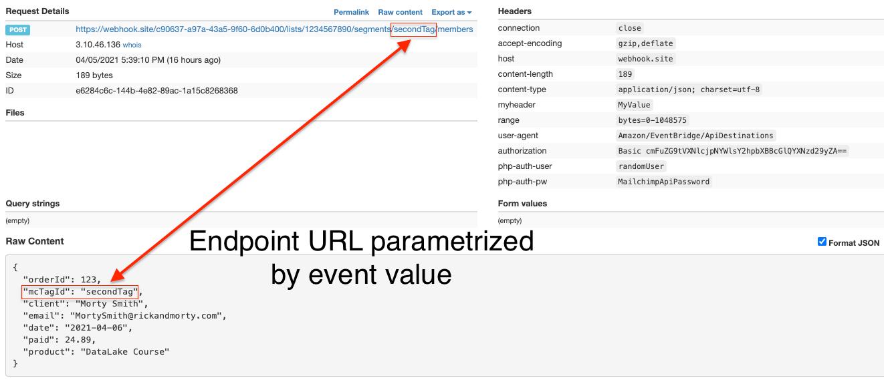

# Amazon EventBridge API Destinations with parametrized endpoint URL and Mailchimp integration example.
Sample project to demonstrate how to use Event Bridge API Destinations to integrate with Mailchimp or any other endpoint on th Internet. This project shows how to use **HTTP Path Parameters** to trigger different endpoints based on message content.

You can deploy this sample on your AWS account in just few minutes and play with it. Please follow instructions below.

## Technologies
This project uses **Node.js** and **Serverless Framework** + **CloudFormation** (which is embedded inside Serverless Framework configuration file `serverless.yml`).

## Tutorial
Please read full article at dev.to website explaining contents of this example.

# How to deploy?
## Code preparation

You need to clone this project, and install dependencies:
```
git clone https://github.com/serverlesspolska/eventbridge-api-destinations-mailchimp.git
cd eventbridge-api-destinations-mailchimp
npm i
```
This requires `node.js` and `npm` be installed on your machine.

## Configuration

As not everyone uses Mailchimp, in the project I defined a second API Destinations `Target` that sends REST requests to `webhook.site` service. This is a free, easy to use web application that will work as our 3rd party endpoint.

Please go to the [webhook.site](https://webhook.site) and copy **Your unique URL**. Paste that URL into `serverless.yml` config file in line `38`:
```
    endpoint: <REPLACE_ME_WITH_REAL_WEBHOOK_SITE_URL> # Your Webhook URL
```

By default, project is setup to be deployed in `eu-west-2` - London region - using `default` AWS profile. If you want to change deployment region or profile you may do it in `config/deployment.yml` file.

## Solution deployment

Now we're ready to deploy the project to the `dev` stage using command:
```
sls deploy
```
(This assumes that you have your `default` AWS profile defined under `~/.aws/credentials`.)


# How to run this example?

After successful deployment (can take few minutes) you can invoke a Lambda function, that will send **two** sample `Order` events to the *EventBus*. 
```
sls invoke -f sendOrderEvent -l
```
As a result, you should see the new request on the `webhook.site` website (your custom URL). That means that API Destinations just called the endpoint responding to the new message on the *EventBus*.

### Sample
Here is a sample request received by webhook.site.


## Debuging
Mailchimp `Target` is not configured with real IDs and passwords. Therefore each event sent to the EventBus will not be delivered to Mailchimp. 

You can see failed events moved from `EventBus` to a Dead Letter Queue (DLQ) named `dev-eb-api-dest-sample-eventbus-DLQ` in your deployment region.

# How can I remove this sample from my AWS Account?
To remove this project, simply execute following command in project folder:
```
sls remove
```